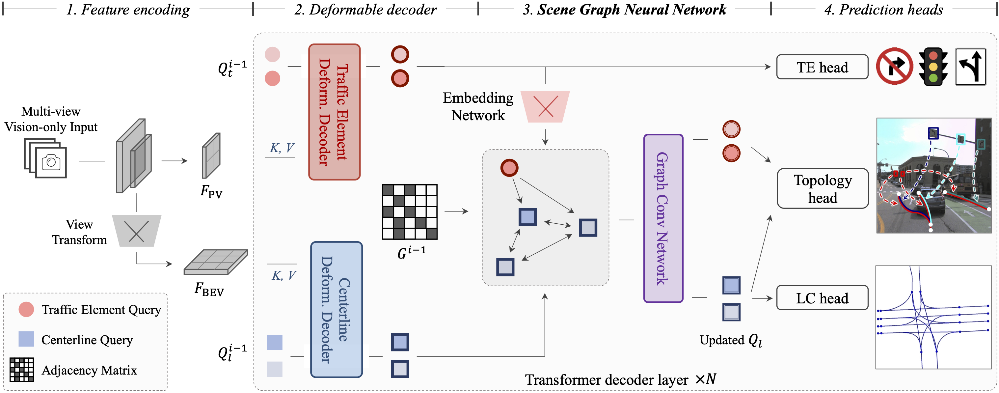

<div align="center">

# TopoNet: A New Baseline for Scene Topology Reasoning

## Graph-based Topology Reasoning for Driving Scenes

[](./LICENSE)




</div>

---

This repository contains the source code of **TopoNet**.

TopoNet is the first end-to-end framework capable of abstracting traffic knowledge beyond conventional perception tasks, _i.e._, **reasoning connections between centerlines and traffic elements** from sensor inputs. It unifies heterogeneous feature
learning and enhances feature interactions via the graph neural network architecture and the knowledge graph design. 

Instead of recognizing lanes, we adhere that modeling the lane topology is `appropriate` to construct road components within the perception framework, to facilitate the ultimate driving comfort. 


## Prerequisites

- Linux
- Python 3.8.x
- NVIDIA GPU + CUDA 11.1
- PyTorch 1.9.1

## Installation

We recommend using [conda](https://docs.conda.io/en/latest/miniconda.html) to run the code.
```bash
conda create -n toponet python=3.8 -y
conda activate toponet

# (optional) If you have CUDA installed on your computer, skip this step.
conda install cudatoolkit=11.1.1 -c conda-forge

pip install torch==1.9.1+cu111 torchvision==0.10.1+cu111 -f https://download.pytorch.org/whl/torch_stable.html
```

Install mm-series packages.
```bash
pip install mmcv-full==1.5.2 -f https://download.openmmlab.com/mmcv/dist/cu111/torch1.9.0/index.html
pip install mmdet==2.26.0
pip install mmsegmentation==0.29.1
pip install mmdet3d==1.0.0rc6
```

Install other required packages.
```bash
pip install -r requirements.txt
```

## Prepare Dataset

Following [OpenLane-V2 repo](https://github.com/OpenDriveLab/OpenLane-V2/blob/v1.0.0/data) to download the data and run the [preprocessing](https://github.com/OpenDriveLab/OpenLane-V2/tree/v1.0.0/data#preprocess) code.

```bash
cd TopoNet
mkdir data && cd data

ln -s {PATH to OpenLane-V2 repo}/data/OpenLane-V2
```

After setup, the hierarchy of folder `data` is described below:
```
data/OpenLane-V2
├── train
|   └── ...
├── val
|   └── ...
├── test
|   └── ...
├── data_dict_subset_A_train.pkl
├── data_dict_subset_A_val.pkl
├── data_dict_subset_B_train.pkl
├── data_dict_subset_B_val.pkl
├── ...
```

## Train and Evaluate

### Train

We recommend using 8 GPUs for training. If a different number of GPUs is utilized, you can enhance performance by configuring the `--autoscale-lr` option. The training logs will be saved to `work_dirs/toponet`.

```bash
cd TopoNet
mkdir -p work_dirs/toponet

./tools/dist_train.sh 8 [--autoscale-lr]
```

### Evaluate
You can set `--show` to visualize the results.

```bash
./tools/dist_test.sh 8 [--show]
```

## License

All assets and code are under the [Apache 2.0 license](./LICENSE) unless specified otherwise.
